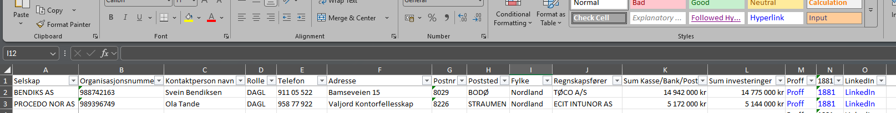

Litt diverse jobb knask for Skagen Gutta
Last ned fra mappen script-for-skagen/hente-info-om-kunder/Brreg_Proff_fallback.script.py

Hvor enn du lagrer filen
kjør python --input sti til filnavn --output stig og filnavn.xlsx

feks:

Du laster ned Brreg_Proff_fallback.script.py til en mappe:
feks: 
c:\scripts\Brreg_Proff_fallback.script.py
Du har lagret kundelisten
feks
c:\kunder\ebbekunder.xlsx

start cmd
python c:\scripts\Brreg_Proff_fallback.script.py --input c:\kunder\ebbekunder.xlsx --output c:\kunder\ebbekunderresultat.xlsx

hvis du vil feks bare ta de 5 første kundene er konmmandoen
python c:\scripts\Brreg_Proff_fallback.script.py --input c:\kunder\ebbekunder.xlsx --output ebbekunderresultat.xlsx --limit 5

NB!
skriptet tror at første rad er overerskrifter, så god vane er at overskrit i input fil er

Selskap	        orgnr
BENDIKS AS	    988742163
PROCEDO NOR AS	989396749
osv

scriptet kjører og viser fremdrift:
Henter 
1/125
2/125
osv

resultat

